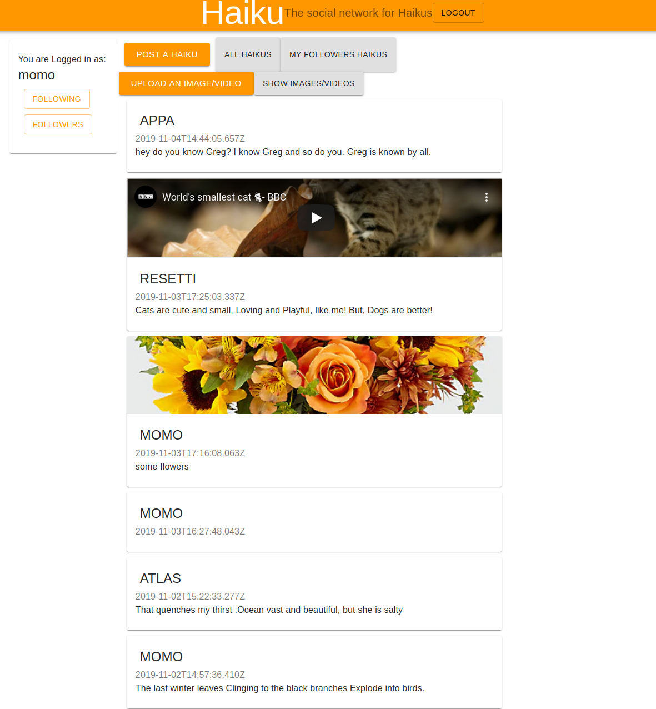
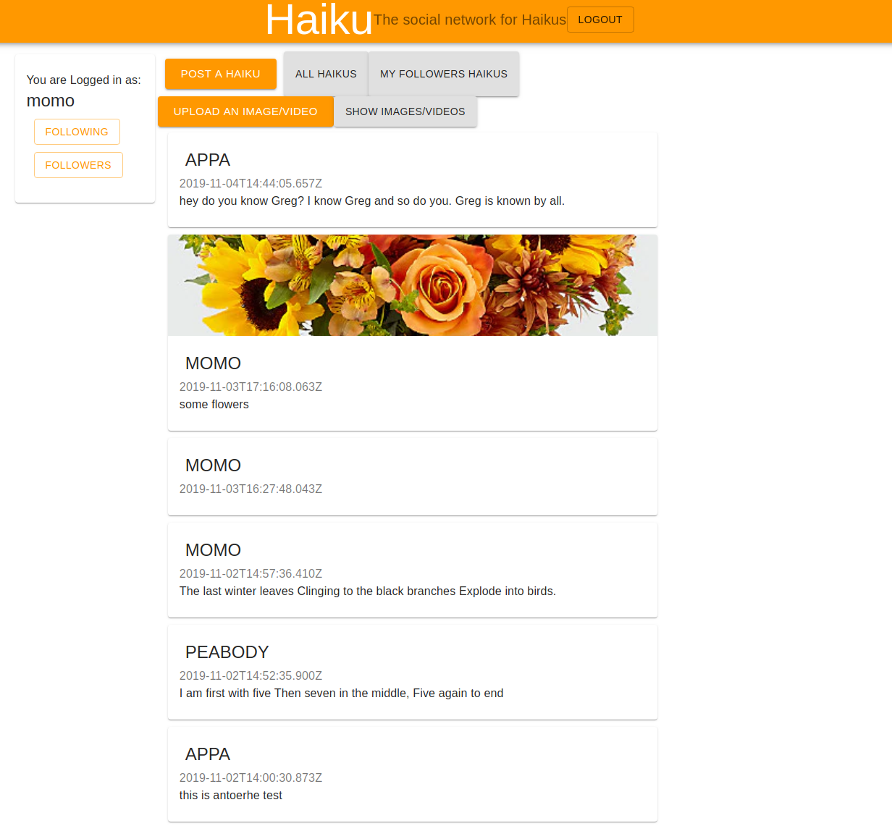
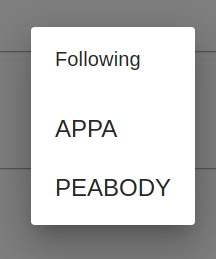
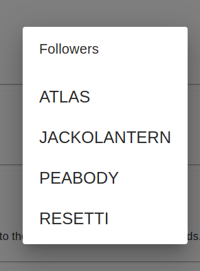
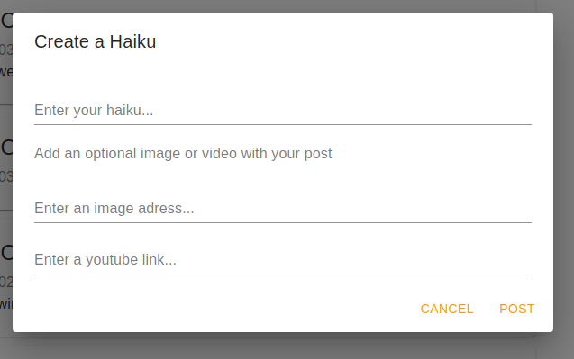
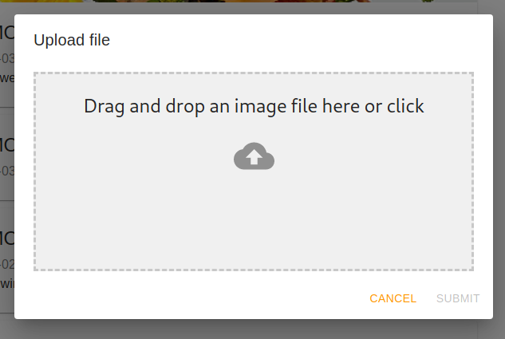
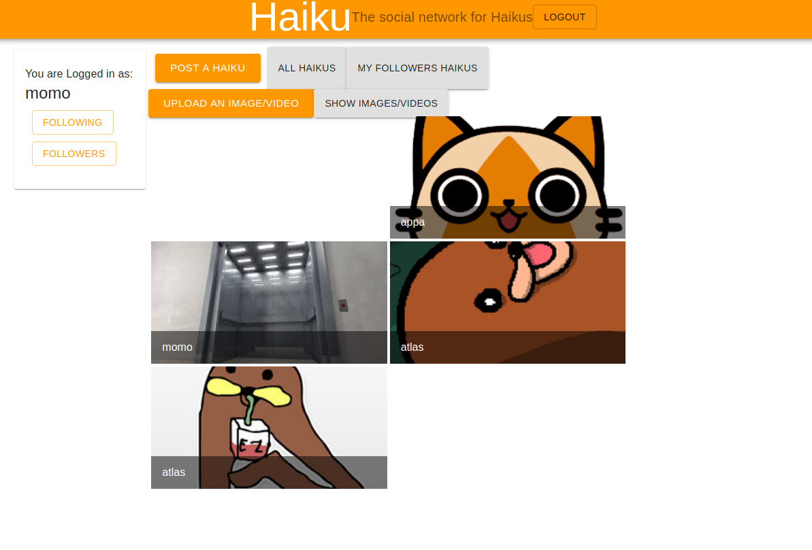

# Stand-in for Website

Currently the react front end I am hosting on Azure Web App is very temperamental.

Sometimes the web app will work, sometimes it does not.  

**I took this issues to Les**. Neither of us had the knowledge to fix the issues and he recommended creating this document with proof of the I'd done the work.

I am able to run the web app locally and it functions fully so on his advise I will screenshot the app working and provided evidence here as well as in the submitted report.

Here is the link to the current version of the web app:

https://haikutwitter.azurewebsites.net/

*If the application does load:* *Due to the cold start of the Azure functions app, when first calling the servers for posts or again for images/video the GET request will return nothing for the first ~30 seconds while Azure boots up the function app*

If the application doesn't work please refer to the following screen shots for proof of work

##### Sign in page:

 

- Ability to login via a pop up

- Ability to sign up via a pop up

##### Home Page:

- All Posts show by clicking 'All Haikus'

- Users timeline shown by clicking 'My followers haikus'

- Following shown on pop up by clicking on following button on profile

- Followers shown on pop up by clicking on followers button on profile

- Form to compose a post shown on pop up by clicking post a haiku button

- Pop up to upload a file shown by clicking upload an image/video

- Display user uploaded images and videos by clicking 'Show images and videos'

